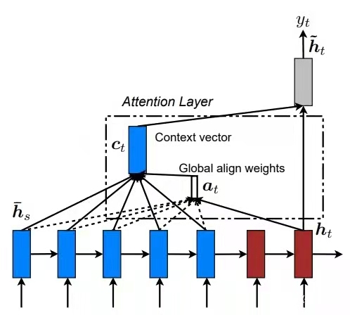

# Get Started

- 环境配置
  - python=3.7.11
  - pytorch=1.0.0
  - torchvision
  - numpy
  - scipy
  - numpy
  - nltk
  - tqdm
  - pyinstaller
  
- 建立词典：`sh run_en-zh.sh vocab`
- 训练： `sh run_en-zh.sh train` (GPU)
- 测试：`sh run_en-zh.sh test` (CPU)
- 如要使用GPU，在`run_en-zh.sh`文件中将对应命令末尾添加 `--cuda=True`，否则，删除该选项。

项目已开源到Github： [Youth-49/EN-ZH-NMT-seq2seq: 英译中的seq2seq+Attention+Beam search NMT模型 (github.com)](https://github.com/Youth-49/EN-ZH-NMT-seq2seq)

打包生成的可执行文件通过Google drive共享：https://drive.google.com/file/d/12S42kc4Q19ArRrjMIa_ymQUP8jnRqvAr/view?usp=sharing

模型文件（model.bin, model.bin.optim）通过Google drive共享：https://drive.google.com/file/d/1HqKoNlm9ElCSaCJBXIjsSKWaaFQv9YC0/view?usp=sharing

# 数据集

本实验使用的数据集为`WMT18`新闻评论数据集`New Commentary v13`$^{[1]}$，包含252777条中英平行语料。

 

# 模型

## 模型架构

构建本模型的目的是将源语言转换为目标语言，实现英译中的机器翻译任务。为了实现此目标，我们使用带有注意力机制的`seq2seq`网络来搭建神经机器翻译系统（`NMT`），此系统由`Bi-LSTM`的`Encoder`和一个单向`LSTM`的`Decoder`组成。

###  模型概述

####  Seq2seq网络

`Seq2seq`网络是一个`Encoder-Decoder`结构网络，由一个Encoder和一个Decoder组成。在应用于机器翻译的`seq2seq`模型中，输入是一个单词序列（`vector sequence`），输出是一个单词序列（`vector sequence`），输入和输出的序列长度均可变；`Encoder`负责将输入序列转换为`context vector`，该向量包含了输入序列所有的信息，`Decoder`则负责由`context vector`确定输出序列。

#### 注意力机制

普通的`seq2seq`模型存在如下问题：`Decoder`过分依赖于`Encoder`在最后`time step`生成的向量（`context vector`）。这个向量需要包括输入序列所有的信息，否则`Decoder`将难以产生正确的输出。而`context vector`难以涵盖输入序列所有的信息。这个问题被称作**信息瓶颈**。

实际上，`Decoder`在生成输出序列中的每一个词时，可能只需利用输入序列的某一部分信息。由此，我们引入了注意力机制，以实现让模型能够根据信息的有用程度分配权重。

 

#### LSTM

`LSTM`，长短期记忆，是一种特殊结构的序列神经网络，主要解决了长序列训练过程中的梯度消失和梯度爆炸问题。

`LSTM`的核心概念在于`cell state`和`gate`的结构。`cell state`相当于信息传输的路径，让信息能够在序列中传递下去。`gate`结构则实现了信息的添加或移除，`gate`结构在训练过程中会去学习该保存或遗忘哪些信息。

 

 

### 模型子组件原理

 

#### Encoder

给定的一个源语言序列，通过查询`embedding`向量矩阵，产生一个词向量序列$x_1,...,x_m(x_i\in \mathbb{R}^{e\times1})$，其中$m$是输入句子的长度，$e$是`embedding`向量维数。
接着，将这些`embedding`向量输入到`Bi-LSTM`中，为前向和后向的`LSTM`各产生一个`hidden state`向量和`cell state`向量，两个方向的向量在每个`time step`对应拼接，形成`Encoder`的`hidden state`向量$h^{enc}_i$和`cell state`向量$c^{enc}_i$：
$$
h_i^{enc}=[\mathop{h^{enc}_i}\limits ^{\leftarrow};\mathop{h^{enc}_i}\limits ^{\rightarrow}]\\
c_i^{enc}=[\mathop{c^{enc}_i}\limits ^{\leftarrow};\mathop{c^{enc}_i}\limits ^{\rightarrow}]
$$

####  Decoder

`Encoder`的最终`hidden state`和最终`cell state`经过线性变换，得到`Decoder`第一个`hidden state`向量$h_0^{dec}$和第一个`cell state`向量$c_0^{dec}$：
$$
h_0^{dec}=W_h[\mathop{h^{enc}_1}\limits ^{\leftarrow};\mathop{h^{enc}_m}\limits ^{\rightarrow}] 
\\
c_0^{dec}=W_c[\mathop{c^{enc}_1}\limits ^{\leftarrow};\mathop{c^{enc}_m}\limits ^{\rightarrow}] 
$$
`Decoder`初始化完成后，我们将目标句子输入到`Decoder`中。给定的一个目标语言序列，通过查询`embedding`向量矩阵，产生一个词向量序列$y_1,...y_m(y_t\in \mathbb{R}^{e\times1})$；然后将$y_t$与上一个时间步的结合输出向量$o_{t-1}\in \mathbb{R}^{h\times1}$相拼接，产生$\bar{y_t}\in  \mathbb{R}^{(e+h)\times1}$，将$\bar{y_t}$输入到`Decoder`中，产生`hidden state`和`cell state`：
$$
h_t^{dec},c_t^{dec}=Decoder(\bar{y_t},h_{t-1}^{dec},c_{t-1}^{dec})
$$
在此基础上，为了达到更好的训练效果，我们在`Decoder`中使用了**Teacher Forcing**技术，其原理为：在训练的第t个时间步，使用训练数据集的期望输出或实际输出：$y_t$，作为下一时间步的输入，而不是使用模型生成的输出。

 

#### 注意力层

在第t个时间步中，用$h_t^{dec}$计算其相对于$h_1^{enc},...,h_m^{enc}$的注意力：
$$
e_{t,i}=(h^{dec}_t)^TW_{attProj}h_i^{enc}
,\quad1\leq i \leq m \\
\alpha_t = softmax(e_t)
 \\
a_t = \Sigma_{t=1}^m\alpha_{t,i}h^{enc}_i
$$

#### 最终输出模块

将注意力层的输出$a_t$与`Decoder`的`hidden state`向量$h_t^{dec}$相拼接，并且传送到`tanh`层和`dropout`层从而获得输出向量$o_t$：
$$
u_t=[a_t;h_t^{dec}] \\
v_t = W_uu_t \\
o_t = dropout(tanh(v_t)) 
$$
输出向量$o_t$经过$softmax$，产生一个概率分布$P_t$：
$$
P_t=softmax(W_{vocab}o_t)
$$
其中，$V_t$是目标语言词典的大小。最后，为了训练神经网络，我们计算$P_t$和$g_t$之间的交叉熵损失，$g_t$是目标单词序列对应的`one-hot vector`：
$$
J_t(\theta)=CrossEntropy(P_t,g_t)
$$
其中，$\theta$代表模型的全部参数，$J_t(\theta)$是`Decoder`第k个时间步的交叉熵损失。

 

### 损失函数

本实验所使用的损失函数为交叉熵损失函数（`CrossEntropy`）：

$$
CrossEntropy(p,q)=-\Sigma^n_{i=1}p(x_i)log(q(x_i))
$$
交叉熵用于衡量同一个随机变量中两个不同概率分布的差异程度，在机器翻译任务中表示为真实概率分布和预测概率分布的差异。交叉熵的值越小，模型预测效果越好。

交叉熵函数通常搭配`softmax`使用，将输出的结果进行处理，使其多个分类的预测值和为1，再通过交叉熵来计算损失。

 

### 模型测评

本实验使用`BLEU`对模型进行测评。`BLEU`是`NMT`系统最常用的自动测评矩阵，它通常基于整个测试集进行计算。

以一个样本为例进行说明。

给定一个源语言句子$s$，对应有一组参考翻译序列$r_1,...,r_k$，和一组候选翻译$c$。为了计算$c$的BLEU指标，首先计算$c$的改进n-gram精确度$p_n$，$n=1,2,3,4$
$$
p_n=\frac{\Sigma_{n-gram\in c}min(max(Count_{r_i}(n-gram)),Count_c(n-gram))}{\Sigma_{n-gram}Count_c(n-gram)}
$$
接着，计算过短惩罚`BP`。设$c$的长度为$len(c)$，设最接近$len(c)$的参考翻译的长度为$len(r)$（如果两个参考翻译的长度和$len(c)$同样接近，则取较短的那个)。
$$
BP=
\begin{cases}
& 1 \quad & if\space len(c)\geq len(r),\\
& exp(1-\frac{len(r)}{len(c)})\quad &otherwise
\end{cases}
$$
最后，计算$c$相对于$r_1,...,r_k$的BLEU值：
$$
BLEU=BP \times \exp(\Sigma^4_{n=1}\lambda_n log(p_n))
$$
其中$\lambda_1,\lambda_2,\lambda_3,\lambda_4$是总和为1的权重，$log$为自然对数。

 

## 训练

 数据集划分：$train\space set: dev\space set :test \space set = 6:2:2$。

为了达到更好的训练效果，建立字典时，将字典中出现次数小于2次的去除。

### 参数设置

训练过程的参数设置如下：

| batch_size    | beam_size      | clip_grad       | dropout      | lr                | lr_decay      |
| ------------- | -------------- | --------------- | ------------ | ----------------- | ------------- |
| 32            | 5              | 5.0             | 0.3          | 0.001             | 0.5           |
| **max_epoch** | **embed_size** | **hidden_size** | **patience** | **num_max_trial** | **Optimizer** |
| 30            | 256            | 256             | 5            | 5                 | Adam          |

### 训练技术

#### Beam Search

传统的贪心做法时，每次选择输出概率最大的一个单词，但局部最优解无法保证全局最优解。而在采用`Beam search`的情况下，每次会选择`beam_size`个概率最大的单词（本实验中`beam_size ` = 5），然后进行下一步，依次类推。

#### Gradient Clipping

在模型训练过程中，梯度可能变得太大而使得模型参数不稳定，称为梯度爆炸问题。

为了解决梯度爆炸问题，采用`Gradient Clipping`技术。如果梯度变得非常大，我们就调节它使其保持较小的状态。即，如果$||g||\geq c$，则
$$
g\leftarrow c\centerdot g/||g|| 
$$
此处$c$指参数`clip_grad`（本实验中`clip_grad` = 5.0），$g$指梯度，$||g||$指梯度的2-范数。

Gradient Clipping确保了梯度矢量的最大范数。有助于梯度下降保持合理。

#### Early Stopping

采用`early stopping`方法，设置`patience`为5，`max_num_trial`为5，即：若模型在验证集上的测评效果连续变差次数超过5次，则重启到之前最好的模型参数和优化器参数，并减小学习率（本实验中`lr_decay` = 0.5），最多重启5次。 

 

## 训练/测试结果

训练后，在验证集上结果：**perplexity：10.08**

在测试集上结果：**Corpus BLEU: 27.04**

测试集上翻译结果如图（部分）：

# 模型部署

我们使用`tkinter`作为主要的GUI界面设计工具，使用`pyinstaller`工具进行打包。

## GUI设计

#### 工具介绍

`tkinter` 是使用 python 进行窗口视窗设计的模块。`tkinter`模块("Tk 接口")是Python的标准Tk GUI工具包的接口。作为 python 特定的GUI界面，是一个图像的窗口，`tkinter`是python 自带的、可以编辑的GUI界面。

#### 页面布局

GUI主要分为三个界面：登录界面、注册页面和翻译界面。

登陆页面上方任务栏显示"welcome to translation system(EN->ZH)"，页面中间有输入用户名(user)以及密码(pwd)的文本框。下方有两个按钮，分别是`login`和`register`，表示登录、注册。

翻译界面左上方任务栏显示“Translation (EN->ZH)”，页面中间有输入待翻译句子的文本框(EN)，有翻译(`Translation`)和清空输入栏(`Clear the board`)的按钮，下方显示翻译结果。

注册页面分为三栏，输入待注册的用户名、密码、确认密码，点击`register confirm` 进行注册认证，返回消息提示框，提示注册成功。

#### 交互逻辑设计

登录：输入用户名和密码后，调用`get()`，获取文本信息，将获得到的信息与本地字典进行信息匹配，判断用户名和密码是否匹配(如果没有，则新建本地数据库)，若不存在该用户信息，提示该用户是否注册。注册时输入用户名、密码、重复密码，点击确认注册按钮即可。

翻译：点击`Translation`按钮或按下回车键(`Enter`)，软件将加载训练好的模型文件，将输入的英文句子作为模型的输入，得到输出，显示在下方的多行文本框中。

## 程序打包

#### 工具介绍

`PyInstaller`是一个能将Python程序转换成单个可执行文件的程序，操作系统支持Windows, Linux, Mac OS X, Solaris和AIX。并且很多包都支持开箱即用，不依赖环境。

#### 使用流程

安装`Pyinstaller`

> pip install pyinstaller

使用`Pyinstaller`生成可执行程序

> pyinstaller [option] [file]

这里，在根目录下执行指令：`pyinstaller -w main.py`，在生成的dist文件夹中可看到生成的文件夹，其中可执行文件为`mian.exe`，将模型文件`model.bin`复制到dist目录下，即可双击运行`main.exe`

## 软件使用

- 双击`main.exe`文件，运行打包好的程序。

- 在出现软件主页面之后，输入正确的用户名、密码，点击`login`按钮进行软件登录

- 登陆成功后，进入主页面，输入待翻译句子，点击`Translate`按钮进行翻译

# 分工情况

闫国琛

- 模型搭建，模型训练与测试，程序打包

刘栋

- GUI界面设计，接口设计

吕浩欣

- 文档撰写，模型验证

胡亦楠

- 文档撰写，模型验证

# Reference

[1]: [Translation Task - EMNLP 2018 Third Conference on Machine Translation (statmt.org)](http://statmt.org/wmt18/translation-task.html)

[2]: [pcyin/pytorch_nmt: A neural machine translation model in PyTorch (github.com)](https://github.com/pcyin/pytorch_nmt)

[3]: Stanford cs224N

